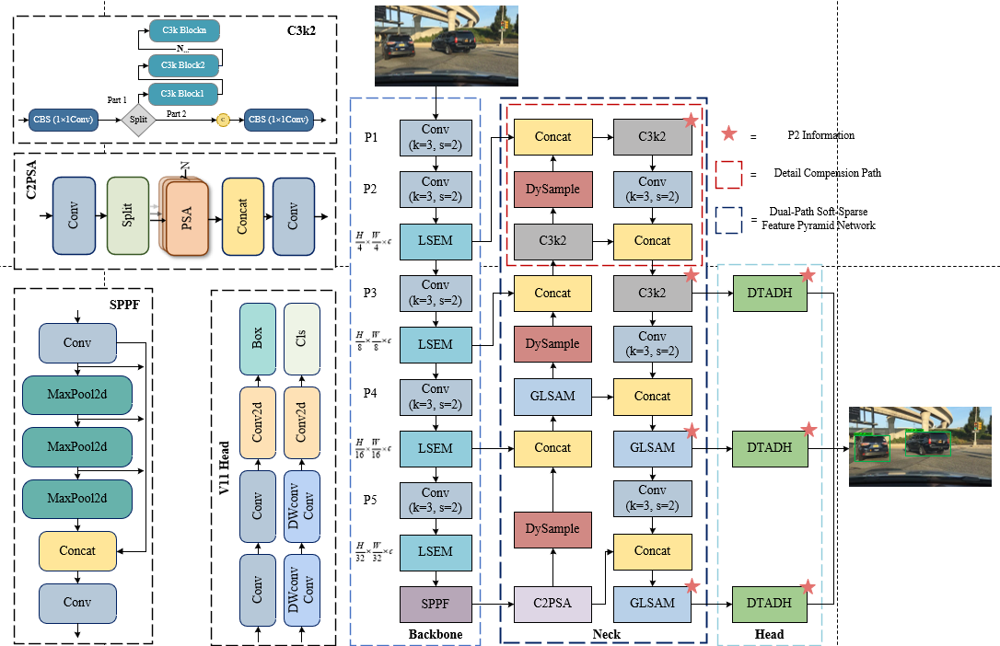

# ED-YOLO

Official implementation of **ED-YOLO: A YOLOv11-Based Robust Road Object Detection Network for Autonomous Driving Scenarios**.

ED-YOLO is a lightweight road-object detection network built on YOLOv11-N for autonomous-driving scenarios. It introduces learnable edge enhancement, detail-preserving feature fusion, global–local sparse attention, dynamic upsampling, and a task-aligned decoupled detection head to improve detection performance for occluded objects, small distant targets, and complex road scenes.

## Main Components

The main modules of ED-YOLO are implemented in the following files:

```text
LSEM.sh        # Learnable Selective Edge Enhancement Module
GLSAM.sh       # Global–Local Soft-Sparse Attention Module
DySample.sh    # Dynamic upsampling module
DTADH.sh       # Dynamic Task-Aligned Decoupled Head
```

The ED-YOLO model configuration file is located at:

```text
ultralytics/cfg/ED-YOLO.yaml
```

## Repository Structure

```text
ED-YOLO/
├── dataset/                 # Dataset split files and label-conversion information
├── docker/                  # Environment configuration
├── docs/                    # Supplementary documents and figures
├── ultralytics/             # Ultralytics-based implementation
│   └── cfg/
│       └── ED-YOLO.yaml     # ED-YOLO model configuration
├── LSEM.sh                  # LSEM module source code
├── GLSAM.sh                 # GLSAM module source code
├── DySample.sh              # DySample module source code
├── DTADH.sh                 # DTADH module source code
└── README.md
```

## Datasets

Experiments are conducted on BDD100K and KITTI.

### BDD100K

Official website:

```text
https://bdd-data.berkeley.edu/
```

In our experiments, the official BDD100K detection training split is used for training, and the official validation split is used for evaluation. The official test split is not used because its ground-truth annotations are not publicly available.

Only four dynamic road-object categories are retained:

```text
car, bus, truck, person
```

Annotations of other categories are removed during conversion to YOLO format.

### KITTI

Official website:

```text
https://www.cvlibs.net/datasets/kitti/eval_object.php
```

The KITTI object detection benchmark provides 7481 labeled training images and 7518 unlabeled test images. Since the test annotations are not publicly available, the 7481 labeled images are divided into fixed training, validation, and test subsets in our experiments.

To keep the label space consistent with BDD100K, only the following categories are retained:

```text
car, bus, truck, person
```

## Environment

The experiments are conducted using the Ultralytics framework.

```text
Python >= 3.8
PyTorch 2.3.0+cu121
torchvision 0.18.0+cu121
CUDA 12.1
cuDNN 8.9.0.2
Ultralytics
```

## Training

Train ED-YOLO from scratch:

```bash
yolo detect train model=ultralytics/cfg/ED-YOLO.yaml data=dataset/bdd100k.yaml imgsz=640 epochs=300 batch=16 pretrained=False device=0
```

For KITTI:

```bash
yolo detect train model=ultralytics/cfg/ED-YOLO.yaml data=dataset/kitti.yaml imgsz=640 epochs=300 batch=16 pretrained=False device=0
```

## Validation

Evaluate ED-YOLO on BDD100K:

```bash
yolo detect val model=runs/detect/train/weights/best.pt data=dataset/bdd100k.yaml imgsz=640 batch=1 device=0
```

Evaluate ED-YOLO on KITTI:

```bash
yolo detect val model=runs/detect/train/weights/best.pt data=dataset/kitti.yaml imgsz=640 batch=1 device=0
```

All validation experiments use the Ultralytics YOLO validation script with the corresponding converted YOLO-format labels.


```

